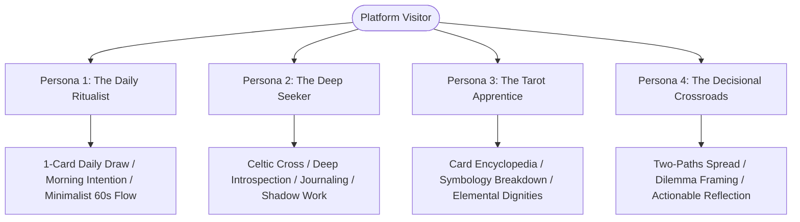
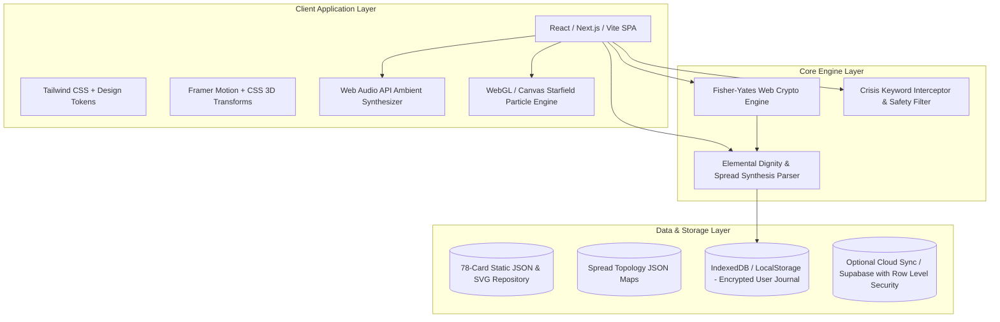
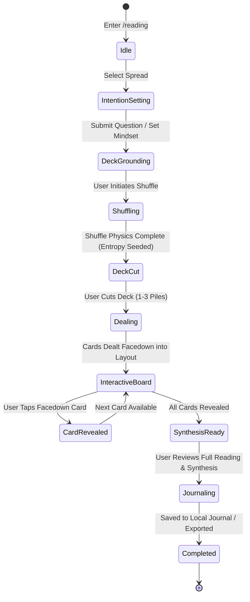

# 08: Digital Tarot Platform Architecture & Engineering Blueprint

---

## 1. Executive Vision & Platform Philosophy

### 1.1 The Digital Transition: From Physical Tabletop to Screen
Tarot reading is traditionally an intimate, multisensory, tactile ritual. The physical experience involves weight, texture, spatial layout, candlelight, and deliberate pacing. In porting tarot to the modern web, a naive approach reduces the deck to a trivial pseudo-random number generator that spits out static card images—stripping away reverence, atmosphere, and psychological engagement.

The goal of this platform is to build an **archetypal digital sanctuary**—a web application that honors the psychological depth, ritual cadence, and reflective power of tarot while leveraging contemporary web capabilities:
*   **Tactile Digital Physics**: Skeuomorphic fluid animations, 3D card perspective flips, drag-and-drop spreading, and responsive haptic/auditory feedback.
*   **Psychological Grounding**: Moving away from fatalistic, fear-inducing "fortune-telling" cliches toward a **Jungian projective mirror** and contemplative personal development instrument.
*   **Absolute Privacy & Zero-Knowledge Architecture**: Safeguarding deeply sensitive personal queries, intimate relationship questions, and journal reflections through local-first or client-side encrypted storage.
*   **Modern Web Standards**: Delivering sub-second interaction times, fluid View Transitions, accessible screen-reader live updates, and progressive web app (PWA) offline usability.

---

## 2. Core User Personas & User Journeys

To ensure the platform balances casual visitors, dedicated practitioners, and curious newcomers, four core archetypal personas guide our feature prioritization:



### 2.1 Persona 1: "The Daily Ritualist" (Elena, 29)
*   **Context**: Starts her morning coffee ritual with a quick moment of mindfulness.
*   **Goal**: Draw a single card of the day, absorb a succinct psychological theme, set an intention, and save it to her daily journal in under 90 seconds.
*   **Key UX Requirement**: Instant access, friction-free "One-Tap Draw" widget on the homepage, zero mandatory login walls for casual use.

### 2.2 Persona 2: "The Deep Seeker" (Marcus, 38)
*   **Context**: Experiencing a major life transition (career pivot, breakup, existential reassessment).
*   **Goal**: Conduct a comprehensive multi-card reading (Celtic Cross or Relationship Spread), reflect deeply on card placements, write detailed personal reflections, and export a private summary.
*   **Key UX Requirement**: Atmospheric ritual mode (candlelight UI, ambient audio drone, intention-focus step), interactive spread board, expansive card breakdown, and encrypted private journaling.

### 2.3 Persona 3: "The Tarot Apprentice" (Aria, 22)
*   **Context**: Learning tarot symbology, astrology correspondences, and Kabbalistic/elemental associations.
*   **Goal**: Explore the 78-card library, compare Major vs. Minor Arcana, study court card dynamics, and understand upright vs. reversed nuances.
*   **Key UX Requirement**: Comprehensive searchable encyclopedia, high-resolution zoomable card artwork, interactive keyword filters, and archetypal study flashcards.

### 2.4 Persona 4: "The Decisional Crossroads" (Julian, 34)
*   **Context**: Stuck between two conflicting choices (stay vs. leave, accept offer A vs. B).
*   **Goal**: Run a structured "Two-Paths" comparative spread to project emotional outcomes and subconscious hesitations.
*   **Key UX Requirement**: Objective question reframing assistant (transforming "Will I get fired?" into "What internal attitudes are influencing my career trajectory?").

---

## 3. Information Architecture & Sitemap

The application architecture prioritizes intuitive discovery, seamless navigation between study and practice, and unhurried contemplative flow.

```
[ Root / Landing Page ]
│
├── /reading (Interactive Sanctuary)
│   ├── Step 1: Intention & Question Framing
│   ├── Step 2: Spread Selection (1-Card, 3-Card, Celtic Cross, Custom)
│   ├── Step 3: Sacred Shuffle & Cut (Tactile Drag/Tap)
│   ├── Step 4: Dealing Canvas (3D Layout & Staggered Reveal)
│   └── Step 5: Synthesis & Journaling (Card Meanings, Reflection Prompts, Save/Export)
│
├── /cards (Archetypal Encyclopedia)
│   ├── /major-arcana (0 The Fool to XXI The World)
│   ├── /wands (Fire: Action, Will, Creativity)
│   ├── /cups (Water: Emotion, Intuition, Relationships)
│   ├── /swords (Air: Intellect, Conflict, Truth)
│   ├── /pentacles (Earth: Materiality, Body, Craft)
│   └── /cards/[card-slug] (Deep-dive: Symbolism, History, Astrological, Upright/Reversed)
│
├── /spreads (Spread Library & Layout Engine)
│   ├── Daily Reflection (1 Card)
│   ├── Past / Present / Future (3 Cards)
│   ├── Mind / Body / Spirit (3 Cards)
│   ├── Situation / Obstacle / Advice (3 Cards)
│   ├── Celtic Cross (10 Cards)
│   └── Relationship Dynamics (5 Cards)
│
├── /journal (Private Sanctuary Log)
│   ├── Calendar & Timeline View
│   ├── Recurring Card Statistics & Arcana Distribution
│   ├── Tagging System (Career, Love, Personal Growth)
│   └── Export to PDF / JSON / Markdown
│
├── /learn (Tutorials & Philosophy)
│   ├── How Tarot Works: The Jungian & Projective View
│   ├── Elemental Dignities & Combinations
│   └── Ethics, Autonomy, and Question Engineering
│
├── /legal (Mandatory Compliance Suite)
│   ├── Terms of Service (Entertainment Disclaimer, Limitation of Liability)
│   ├── Privacy Policy (Zero-Knowledge / Sensitive Personal Data Clause)
│   ├── Ethical Code & Crisis Intervention Resources
│   └── Refund & Digital Goods Policy
│
└── /settings
    ├── Ambient Audio (Volume, Frequency selection: 432Hz / 528Hz / Silent)
    ├── Visual Theme (Midnight Celestial vs. Velvet Obsidian vs. Ethereal Parchment)
    ├── Card Deck Selection (Classic Rider-Waite, Minimalist Gold Line, Midnight Tarot)
    └── Data Management (Local Clear, Export, Key Management)
```

---

## 4. Modern Technical Architecture & Stack

To deliver a high-performance web experience that feels like native desktop software, the recommended tech stack combines modern reactivity, GPU-accelerated rendering, and client-side processing:



### 4.1 Recommended Core Technologies

| Layer | Recommended Technology | Technical Justification |
| :--- | :--- | :--- |
| **Framework** | **Next.js 15+ (App Router)** or **Vite + React 19** | Zero-latency initial page loads via static generation (SSG) for card encyclopedias, combined with rich client-side interactivity for the reading canvas. |
| **Styling & Design System** | **Tailwind CSS v4** + Custom CSS Variables | Ultra-fast tokenized theming (supporting dark obsidian, antique gold, and ethereal teals), dynamic layout container queries, and minimal bundle footprint. |
| **Motion & 3D Cards** | **Framer Motion** + Native **CSS 3D Transforms** | Hardware-accelerated 3D perspective (`perspective: 1200px`, `transform-style: preserve-3d`), smooth spring physics for card dealing, and zero jank. |
| **Atmospheric Particle Canvas** | Lightweight **HTML5 Canvas 2D** or **PixiJS** | Elegant, GPU-efficient floating celestial dust/stars reacting gently to mouse movement without the heavy bundle penalty of full Three.js where not strictly necessary. |
| **Sound Design** | Native **Web Audio API** | Procedural ambient soundscapes (low-frequency warm pads, singing bowl harmonics) and crisp audio sprite playback for card slides, flips, and snaps. No large mp3 file downloads. |
| **Randomness Engine** | Web **`crypto.getRandomValues()`** + User Entropy Seeding | Cryptographically secure, unbiased card selection that eliminates pseudo-random repetition and mathematically simulates physical deck entropy. |
| **Storage & Privacy** | **IndexedDB** via `idb-keyval` or `Dexie.js` | 100% client-side privacy by default. Intimate readings and journal entries never leave the user's browser unless explicit multi-device cloud backup is chosen. |

---

## 5. State Management & Lifecycle Architecture

The reading flow is modeled as a deterministic finite state machine (FSM) to prevent illegal states (e.g., flipping cards before dealing, or drawing 11 cards in a 10-card spread):



### 5.1 Reading Session Data Contract
Every reading session generates an immutable, serializable session object:

```typescript
export interface ReadingSession {
  id: string; // UUID v4
  timestamp: string; // ISO 8601 UTC
  spreadId: 'single-card' | 'past-present-future' | 'celtic-cross' | 'relationship';
  query: {
    questionText: string;
    category: 'general' | 'growth' | 'career' | 'relationships' | 'decision';
    querentMindset?: string;
  };
  deckId: 'rider-waite-smith' | 'celestial-minimalist';
  entropySource: 'crypto-secure-seed' | 'user-gesture-seeded';
  drawnCards: Array<{
    positionIndex: number;
    positionName: string;
    positionDescription: string;
    cardId: string; // e.g., "major-00-the-fool"
    isReversed: boolean;
    revealedAt: string | null;
  }>;
  interpretationSummary: {
    elementalBalance: {
      fire: number;
      water: number;
      air: number;
      earth: number;
    };
    dominantArcana: 'major' | 'minor';
    synthesisNarrative: string;
  };
  userReflection?: {
    notes: string;
    personalTakeaways: string[];
    moodAfterReading: 1 | 2 | 3 | 4 | 5;
    tags: string[];
  };
}
```

---

## 6. Core Web Vitals & Performance Strategy

*   **Largest Contentful Paint (LCP) < 1.2s**:
    *   Preload the facedown card back SVG asset with `fetchpriority="high"`.
    *   SVGs and card illustrations compressed and optimized using WebP/AVIF formats with responsive `<picture>` srcset.
*   **Interaction to Next Paint (INP) < 50ms**:
    *   Zero blocking main-thread calculations during shuffle animations.
    *   Shuffling calculations run instantaneously via cryptographic bitwise operations; animations are strictly delegated to CSS compositor threads (`transform` and `opacity` only).
*   **Cumulative Layout Shift (CLS) = 0.00**:
    *   Explicit `aspect-ratio: 7 / 12` (standard 2.75" x 4.75" tarot card proportions) assigned to all card placeholders to eliminate layout reflow during card deals.
