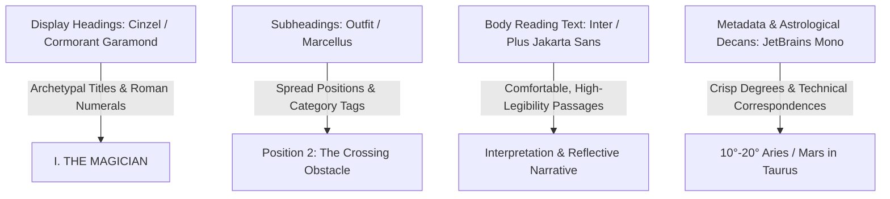

# 09: Psychological UI/UX Design System & Sensory Engineering

---

## 1. The Psychology of Esoteric Interfaces: Creating the "Digital Sanctuary"

### 1.1 Liminal Design: Transitioning from Outer Noise to Inner Stillness
In physical spaces, sacred architecture employs specific thresholds—heavy wooden doors, quiet naves, dim vestibules, diffused candlelight, and incense—to signal to the human nervous system that one has crossed from the profane, chaotic world into a consecrated, contemplative space.

Web applications typically do the opposite: they barrage users with aggressive notification badges, neon CTAs, bouncing chat widgets, and high-contrast alert banners. For an introspective tool like Tarot, such hyper-stimulating UX activates the **sympathetic nervous system (fight-or-flight)**, spiking cortisol and shutting down the intuitive, associative **System 1 cognition** necessary for projective reflection.

The **Digital Sanctuary** model uses **liminal design principles**:
*   **Visual Deceleration**: Generous, unhurried negative space (60%+ canvas breathing room) and low-stimulation dark nocturnal grounds that reduce ocular strain.
*   **Intentional Friction**: Inserting deliberate, rhythmic pacing (a 3-second centering breath, a tactile shuffle gesture, a pause before card reveal) that induces **theta/alpha brainwave states** (4–12 Hz), fostering reflective introspection.
*   **Aesthetic Reverence**: Treating typography, card borders, and icons with the dignity of fine art printmaking rather than utilitarian SaaS software.

```
[ Outer Web Clutter ]
         │
         ▼ (Enter Website)
┌────────────────────────────────────────────────────────┐
│               THE DIGITAL VESTIBULE                    │
│   • Deep Nocturnal Tone Shift (Lowers Ocular Stress)   │
│   • Centering Breath Prompt (Engages Parasympathetic)   │
│   • Intentional Question Formulation                   │
└────────────────────────────────────────────────────────┘
         │
         ▼ (Enter Reading Sanctuary)
┌────────────────────────────────────────────────────────┐
│               THE SANCTUARY CANVAS                     │
│   • 3D Tactile Card Dealing & Physics                  │
│   • Ambient 432Hz Sound Resonance (Harmonic Coherence) │
│   • Single-Card Spotlight & Progressive Disclosure     │
└────────────────────────────────────────────────────────┘
```

---

## 2. Four Production-Ready Color Palettes

Each palette is mathematically calibrated for **WCAG 2.1 AA/AAA accessibility compliance** (minimum 4.5:1 for body copy, 3.0:1 for large display headers) while evoking specific psychological and historical archetypes.

### Palette 1: "The Hermetic Sanctuary" (Default Dark Theme)
*Psychological Association: Mystery, divine illumination (*Lux ex Tenebris*), regal alchemical wisdom, and grounded security.*

```
┌────────────────────────────────────────────────────────────────────────────┐
│ CANVAS: Obsidian Abyss (#0B0B0E)                                            │
│   ┌────────────────────────────────────────────────────────────────────┐   │
│   │ SURFACE: Deep Cosmic Slate (#14141B)                                │   │
│   │   ┌────────────────────────────────────────────────────────────┐   │   │
│   │   │ ACCENT: Alchemical Gold (#D4AF37) — Contrast 8.4:1 (AAA)   │   │   │
│   │   │ TEXT: Antique Bone (#F4EFE6) — Contrast 16.8:1 (AAA)       │   │   │
│   │   │ MUTED: Starlight Silver (#9E9EB2) — Contrast 5.5:1 (AA)    │   │   │
│   │   └────────────────────────────────────────────────────────────┘   │   │
│   └────────────────────────────────────────────────────────────────────┘   │
└────────────────────────────────────────────────────────────────────────────┘
```

| Semantic Role | Token Name | HEX Code | HSL Values | WCAG Contrast (vs Canvas) |
| :--- | :--- | :--- | :--- | :--- |
| **Canvas Background** | `--color-bg-canvas` | `#0B0B0E` | `hsl(240, 12%, 5%)` | *Base Canvas* |
| **Surface / Card Back** | `--color-bg-surface` | `#14141B` | `hsl(240, 14%, 9%)` | 1.2:1 (Subtle elevation) |
| **Card Slot / Container** | `--color-bg-elevated` | `#1D1D27` | `hsl(240, 14%, 13%)` | 1.5:1 |
| **Primary Metallic Gold** | `--color-gold-primary` | `#D4AF37` | `hsl(46, 65%, 52%)` | **8.4:1 (Passes AAA)** |
| **Deep Muted Brass** | `--color-gold-muted` | `#9E8030` | `hsl(44, 53%, 40%)` | **4.6:1 (Passes AA)** |
| **Starlight Highlight** | `--color-gold-light` | `#F5E5A4` | `hsl(48, 83%, 80%)` | **13.5:1 (Passes AAA)** |
| **Primary Typography** | `--color-text-primary`| `#F4EFE6` | `hsl(38, 36%, 93%)` | **16.8:1 (Passes AAA)** |
| **Secondary Typography**| `--color-text-muted` | `#9E9EB2` | `hsl(240, 12%, 66%)` | **5.5:1 (Passes AA)** |
| **Subtle Border/Glow** | `--color-border-glow` | `rgba(212, 175, 55, 0.22)` | — | Micro-borders & glows |

---

### Palette 2: "The Astral Veil" (Nocturnal Navy & Violet)
*Psychological Association: Third-eye opening, dreamwork, intuition, subconscious depths, and celestial exploration.*

| Semantic Role | Token Name | HEX Code | HSL Values | WCAG Contrast |
| :--- | :--- | :--- | :--- | :--- |
| **Canvas Background** | `--color-bg-astral` | `#080C14` | `hsl(220, 43%, 6%)` | *Base Canvas* |
| **Surface Container** | `--color-surface-astral`| `#101726` | `hsl(221, 41%, 11%)` | Surface elevation |
| **Primary Amethyst** | `--color-amethyst` | `#8B5CF6` | `hsl(258, 90%, 66%)` | **6.2:1 (Passes AA)** |
| **Celestial Lilac** | `--color-lilac-glow` | `#C4B5FD` | `hsl(253, 94%, 85%)` | **11.8:1 (Passes AAA)** |
| **Astral Silver Text** | `--color-text-silver` | `#E2E8F0` | `hsl(214, 32%, 91%)` | **15.2:1 (Passes AAA)** |
| **Nebula Shimmer** | `--color-nebula` | `#2E1065` | `hsl(261, 73%, 23%)` | Ambient radial glows |

---

### Palette 3: "The Herbalist’s Grove" (Emerald & Aged Brass)
*Psychological Association: Earth-centered spirituality, grounding, healing, botanical pagan tradition, somatic renewal.*

| Semantic Role | Token Name | HEX Code | HSL Values | WCAG Contrast |
| :--- | :--- | :--- | :--- | :--- |
| **Canvas Background** | `--color-bg-grove` | `#05130E` | `hsl(160, 60%, 5%)` | *Base Canvas* |
| **Surface Container** | `--color-surface-grove` | `#0D221A` | `hsl(159, 45%, 9%)` | Surface elevation |
| **Radiant Emerald** | `--color-emerald` | `#10B981` | `hsl(161, 84%, 39%)` | **6.5:1 (Passes AA)** |
| **Harvest Gold** | `--color-harvest-gold` | `#E5C07B` | `hsl(39, 67%, 69%)` | **10.2:1 (Passes AAA)** |
| **Bleached Linen Text** | `--color-text-linen` | `#F7F5F0` | `hsl(43, 25%, 96%)` | **17.5:1 (Passes AAA)** |
| **Muted Eucalyptus** | `--color-eucalyptus` | `#6E8B7E` | `hsl(154, 12%, 49%)` | **4.8:1 (Passes AA)** |

---

### Palette 4: "The Ancient Grimoire" (Daylight / Sun Mode - Parchment)
*Psychological Association: Academic scholarship, historic illuminated manuscripts, daytime reading comfort without eye strain.*

| Semantic Role | Token Name | HEX Code | HSL Values | WCAG Contrast |
| :--- | :--- | :--- | :--- | :--- |
| **Canvas Background** | `--color-bg-grimoire` | `#F5EFEB` | `hsl(24, 29%, 94%)` | *Base Canvas (Day)* |
| **Surface / Card Back** | `--color-surface-grimoire`| `#EAE0D5` | `hsl(32, 31%, 88%)` | Card surface |
| **Alchemical Ink (Text)**| `--color-ink-black` | `#1A1615` | `hsl(12, 9%, 9%)` | **14.8:1 (Passes AAA)** |
| **Illuminated Crimson** | `--color-crimson-rubric`| `#881337` | `hsl(342, 75%, 30%)` | **7.1:1 (Passes AAA)** |
| **Burnished Sepia** | `--color-sepia-muted` | `#78553D` | `hsl(25, 33%, 36%)` | **5.4:1 (Passes AA)** |
| **Illuminated Gold Trim**| `--color-leaf-gold` | `#B48222` | `hsl(39, 68%, 42%)` | **4.7:1 (Passes AA)** |

---

### 2.5 Elemental Suit Accent Palettes
When rendering the 56 Minor Arcana cards, the UI dynamically applies suit-specific micro-accents to communicate elemental alchemy:

```css
:root {
  /* Wands (Fire / South / Salamanders): Creative Will & Passion */
  --suit-wands-accent: #E26D5C;
  --suit-wands-glow: rgba(226, 109, 92, 0.35);

  /* Cups (Water / West / Undines): Emotion, Intuition & Relationships */
  --suit-cups-accent: #3A86C8;
  --suit-cups-glow: rgba(58, 134, 200, 0.35);

  /* Swords (Air / East / Sylphs): Intellect, Truth & Conflict */
  --suit-swords-accent: #A2D2FF;
  --suit-swords-glow: rgba(162, 210, 255, 0.35);

  /* Pentacles (Earth / North / Gnomes): Materiality, Body & Wealth */
  --suit-pentacles-accent: #588157;
  --suit-pentacles-glow: rgba(88, 129, 87, 0.35);
}
```

---

## 3. Typography Hierarchy & Font Pairings

The typographic strategy marries Renaissance bookmaking elegance with crisp digital UI readability:



### 3.1 Font Pairing Matrix

| Typography Level | Font Family | Fallback Stack | Recommended Weight | Tracking (Letter-spacing) | Line Height |
| :--- | :--- | :--- | :--- | :--- | :--- |
| **Hero Display / Arcana** | **Cinzel** or **Cormorant Garamond** | `Georgia, serif` | SemiBold (600) | `+0.08em` (Lapidary Roman) | 1.2 |
| **Section Headings / Spreads**| **Marcellus** or **Playfair Display**| `Times New Roman, serif` | Regular (400) | `+0.04em` | 1.35 |
| **Body / Card Interpretations**| **Inter** or **Plus Jakarta Sans** | `system-ui, sans-serif` | Regular (400) / Medium (500) | `+0.01em` | **1.70** (Relaxed reading) |
| **Introspective Journaling** | **EB Garamond** or **Lora** | `Georgia, serif` | Regular (400) Italic | `0.00em` | 1.65 |
| **Astrological / Card Decans** | **JetBrains Mono** or **Space Mono** | `monospace` | Regular (400) | `-0.02em` | 1.4 |

---

## 4. Skeuomorphic Textures, Glassmorphism & UI Accents

Modern mystical design avoids tacky 1990s bevels, embracing **refined physical textures** layered with modern CSS backdrop blur filters.

### 4.1 Frosted Alchemical Glassmorphism (The "Scrying Mirror" Effect)
Used for floating card docks, spread inspection modals, and journal overlays:

```css
.scrying-glass-card {
  background: rgba(20, 20, 27, 0.72);
  backdrop-filter: blur(16px) saturate(140%);
  -webkit-backdrop-filter: blur(16px) saturate(140%);
  border: 1px solid rgba(212, 175, 55, 0.22);
  border-radius: 16px;
  box-shadow: 
    0 8px 32px 0 rgba(0, 0, 0, 0.55),
    inset 0 1px 1px 0 rgba(255, 255, 255, 0.08),
    inset 0 -1px 1px 0 rgba(212, 175, 55, 0.12);
}
```

### 4.2 Gold Leaf Foil Shimmer Border
Adds a delicate metallic luxury feel to cards and primary action buttons:

```css
.gold-foil-border {
  position: relative;
  border-radius: 12px;
  padding: 1px;
  background: linear-gradient(
    135deg,
    #9e8030 0%,
    #f5e5a4 25%,
    #d4af37 50%,
    #6d551c 75%,
    #e5c07b 100%
  );
}

.gold-foil-border:hover {
  background-size: 200% 200%;
  animation: auricShimmer 3s ease infinite;
}

@keyframes auricShimmer {
  0% { background-position: 0% 50%; }
  50% { background-position: 100% 50%; }
  100% { background-position: 0% 50%; }
}
```

---

## 5. 3D Card Physics, Dealing Choreography & Animations

Card interactions must communicate physical mass, paper texture, and spatial depth.

### 5.1 The Complete 3D Perspective Card Flipper
To support both upright and reversed orientations with hardware-accelerated 3D flips:

```css
/* Card Viewport Container */
.card-scene {
  perspective: 1200px;
  width: 200px;
  height: 343px; /* Standard 7:12 tarot aspect ratio */
}

/* Flipper Element */
.card-flipper {
  position: relative;
  width: 100%;
  height: 100%;
  border-radius: 12px;
  transform-style: preserve-3d;
  transition: transform 0.85s cubic-bezier(0.34, 1.56, 0.64, 1), box-shadow 0.4s ease;
  will-change: transform;
}

/* Upright Flip */
.card-flipper.is-upright-flipped {
  transform: rotateY(180deg);
}

/* Reversed Flip (180deg flip + 180deg inversion) */
.card-flipper.is-reversed-flipped {
  transform: rotateY(180deg) rotateZ(180deg);
}

/* Card Faces */
.card-face {
  position: absolute;
  inset: 0;
  border-radius: 12px;
  backface-visibility: hidden;
  -webkit-backface-visibility: hidden;
  overflow: hidden;
  box-shadow: 0 10px 30px rgba(0, 0, 0, 0.6);
}

/* Facedown Back Design (Sacred Geometry / Constellation) */
.card-face-back {
  background: radial-gradient(circle at center, #1b1a29 0%, #0c0b14 100%);
  border: 1.5px solid rgba(212, 175, 55, 0.35);
}

/* Faceup Front (Card Illustration) */
.card-face-front {
  transform: rotateY(180deg);
  background: #0f1017;
  border: 1.5px solid #d4af37;
}
```

### 5.2 Mathematical Deck Fanning (Polar Coordinate Calculations)
When querents scrub through the virtual 78-card deck to select cards, calculate each card's coordinates along a circular arc:

$$\theta_i = \left(i - \frac{N - 1}{2}\right) \times \Delta\theta$$

$$X_i = R \cdot \sin(\theta_i), \quad Y_i = R \cdot (1 - \cos(\theta_i))$$

Where:
*   $N$ = Total cards visible in fan (e.g. 78 or 22)
*   $\Delta\theta$ = Angular delta per card ($1.8^\circ$ to $2.4^\circ$)
*   $R$ = Arc radius ($800\text{px}$ on desktop, $450\text{px}$ on mobile)

```typescript
export function getFanTransform(cardIndex: number, totalCards: number, radius = 750) {
  const midpoint = (totalCards - 1) / 2;
  const offset = cardIndex - midpoint;
  const angleDeg = offset * 2.1;
  const angleRad = (angleDeg * Math.PI) / 180;

  const translateX = radius * Math.sin(angleRad);
  const translateY = radius * (1 - Math.cos(angleRad));

  return {
    transform: `translate3d(${translateX.toFixed(2)}px, ${translateY.toFixed(2)}px, 0) rotate(${angleDeg.toFixed(2)}deg)`,
    zIndex: cardIndex
  };
}
```

---

## 6. Web Audio API & Sound Design Architecture

Sound creates atmospheric immersion in seconds, but jarring audio causes immediate abandonment.

### 6.1 Audio Architecture Rules
1. **Absolute Zero Autoplay**: The Web Audio `AudioContext` initializes in a `'suspended'` state and only transitions to `'running'` after an explicit user interaction (e.g., clicking "Begin Ceremony" or "Unmute Audio").
2. **Dual-Layer Audio Routing**:
   - **Layer A (Procedural Ambient Drone)**: Continuous low-frequency harmonic drone generated via Web Audio oscillators at 432 Hz (Verdi tuning) or 528 Hz (Solfeggio frequency), low-pass filtered at 320 Hz with a slow 12-second LFO sweep.
   - **Layer B (Tactile SFX)**: Short, organic foley samples for card shuffling, sliding, and revealing.

### 6.2 Native Web Audio Singing Bowl Harmonic Synthesizer
Zero external `.mp3` downloads required; pure procedural mathematical sound synthesis:

```typescript
export class SacredAudioEngine {
  private ctx: AudioContext | null = null;
  private isMuted: boolean = true;

  public initContext(): void {
    if (!this.ctx) {
      const AudioCtx = window.AudioContext || (window as unknown as { webkitAudioContext: typeof AudioContext }).webkitAudioContext;
      this.ctx = new AudioCtx();
    }
    if (this.ctx.state === 'suspended') {
      this.ctx.resume();
    }
    this.isMuted = false;
  }

  public setMute(muted: boolean): void {
    this.isMuted = muted;
  }

  /**
   * Generates a realistic Tibetan Singing Bowl strike
   * @param fundamental Base pitch in Hz (Default: 432 Hz)
   */
  public playSingingBowl(fundamental: number = 432): void {
    if (this.isMuted || !this.ctx) return;
    const now = this.ctx.currentTime;

    // Partial 1: Fundamental Sine
    const osc1 = this.ctx.createOscillator();
    const gain1 = this.ctx.createGain();
    osc1.type = 'sine';
    osc1.frequency.setValueAtTime(fundamental, now);

    // Exponential Decay (Ring out over 4 seconds)
    gain1.gain.setValueAtTime(0.28, now);
    gain1.gain.exponentialRampToValueAtTime(0.0001, now + 4.0);

    // Partial 2: Metallic Overtone (~2.76x frequency)
    const osc2 = this.ctx.createOscillator();
    const gain2 = this.ctx.createGain();
    osc2.type = 'sine';
    osc2.frequency.setValueAtTime(fundamental * 2.76, now);

    gain2.gain.setValueAtTime(0.09, now);
    gain2.gain.exponentialRampToValueAtTime(0.0001, now + 2.4);

    // Connect nodes to output
    osc1.connect(gain1);
    gain1.connect(this.ctx.destination);
    osc2.connect(gain2);
    gain2.connect(this.ctx.destination);

    osc1.start(now);
    osc2.start(now);
    osc1.stop(now + 4.1);
    osc2.stop(now + 2.5);
  }

  /**
   * Generates a crisp paper friction card-slide sound
   */
  public playCardSlide(): void {
    if (this.isMuted || !this.ctx) return;
    const now = this.ctx.currentTime;
    const bufferSize = this.ctx.sampleRate * 0.07; // 70 milliseconds
    const buffer = this.ctx.createBuffer(1, bufferSize, this.ctx.sampleRate);
    const data = buffer.getChannelData(0);

    // Fill buffer with white noise
    for (let i = 0; i < bufferSize; i++) {
      data[i] = Math.random() * 2 - 1;
    }

    const noiseSource = this.ctx.createBufferSource();
    noiseSource.buffer = buffer;

    // Bandpass filter to mimic card stock paper texture
    const filter = this.ctx.createBiquadFilter();
    filter.type = 'bandpass';
    filter.frequency.setValueAtTime(1250, now);
    filter.Q.setValueAtTime(1.8, now);

    const gain = this.ctx.createGain();
    gain.gain.setValueAtTime(0.15, now);
    gain.gain.linearRampToValueAtTime(0.001, now + 0.07);

    noiseSource.connect(filter);
    filter.connect(gain);
    gain.connect(this.ctx.destination);

    noiseSource.start(now);
  }
}
```

---

## 7. Sensory Accessibility & Inclusion (WCAG 2.2 Standards)

A mystical theme must never exclude neurodiverse users or individuals with sensory sensitivities.

### 7.1 Motion Sensitivity & Vestibular Disorders
Users with vestibular disorders experience dizziness or nausea from spinning 3D cards or parallax starfields:

```css
@media (prefers-reduced-motion: reduce) {
  /* Disable 3D transforms */
  .card-scene {
    perspective: none !important;
  }
  .card-flipper {
    transition: opacity 0.3s ease !important;
    transform: none !important;
  }
  .card-flipper.is-upright-flipped .card-face-back,
  .card-flipper.is-reversed-flipped .card-face-back {
    opacity: 0;
    pointer-events: none;
  }
  .card-flipper.is-upright-flipped .card-face-front,
  .card-flipper.is-reversed-flipped .card-face-front {
    opacity: 1;
    transform: none !important;
  }
  /* Stop particle drifting */
  #constellation-canvas {
    display: none !important;
  }
}
```

### 7.2 Screen Reader Announcements (ARIA Live Regions)
Ensure visually impaired querents experience the reading seamlessly:

```html
<!-- Interactive Card Slot -->
<div 
  role="button" 
  tabindex="0"
  aria-label="Celtic Cross Position 1: Present Foundation. Card currently face down. Press Space or Enter to reveal."
  aria-expanded="false"
  class="card-slot">
  <!-- Card markup -->
</div>

<!-- Screen Reader Polite Live Region for Results -->
<div aria-live="polite" class="sr-only" id="reading-announcer">
  <!-- Dynamically injected on flip: -->
  <!-- "Card Revealed: The High Priestess, Upright. Representing intuition, the subconscious, and hidden knowledge. Position: Present Foundation." -->
</div>
```

---

## 8. Mobile-First Responsive Layout Strategy

Over **72% of digital tarot traffic originates on mobile devices** (driven by social sharing, TikTok, Instagram, and WhatsApp links):
*   **Viewport Safeguards**: Fixed card boards must never overflow horizontally. Spreads exceeding 3 cards (such as the 10-card Celtic Cross) automatically adapt to a **two-tab segmented layout** on viewports `< 768px`:
    - *Tab 1: The Circle & Cross* (Cards 1 through 6).
    - *Tab 2: The Staff & Outcome* (Cards 7 through 10).
*   **Touch Targets**: Card selection zones maintain a minimum tap target of **$48\times 48\text{px}$** with a $12\text{px}$ touch buffer.
*   **Haptic Integration**: Trigger `navigator.vibrate(25)` when cards snap into spread slots on Android mobile browsers.
