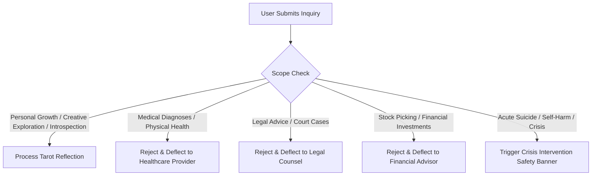

# 10: Legal Compliance, Payment Gateways & Consumer Protection

---

## 1. Statutory Genesis & History of the "Entertainment Only" Clause

The ubiquitous phrase **"For Entertainment Purposes Only"** is not a casual internet convention—it is a specific, legally tested defense mechanism designed to prevent criminal prosecution and civil liability under anti-fraud and fortune-telling statutes.

```
┌─────────────────────────────────────────────────────────────────────────────┐
│                 THE STATUTORY JOURNEY OF DIVINATION LAW                     │
├─────────────────────────────────────────────────────────────────────────────┤
│ 18th–20th Century:                                                          │
│   • Witchcraft & Vagrancy Acts (UK 1735, 1824; US State Penal Codes)        │
│   • Fortune-telling classified as strict liability fraud / vagrancy         │
├─────────────────────────────────────────────────────────────────────────────┤
│ Late 20th Century Statutory Carve-Outs:                                     │
│   • New York Penal Law § 165.35 creates explicit exemption for              │
│     "shows or exhibitions solely for the purpose of entertainment"          │
├─────────────────────────────────────────────────────────────────────────────┤
│ 21st Century Modern Consumer Protection:                                    │
│   • US: First Amendment protects speech, but FTC Act § 5 penalizes          │
│     unsubstantiated claims and deceptive promises of future outcomes        │
│   • UK: Consumer Protection from Unfair Trading Regulations 2008 (CPRs)     │
│     mandates clarity to protect vulnerable consumers                        │
│   • Financial Networks: Visa & Mastercard enforce strict dispute rules      │
└─────────────────────────────────────────────────────────────────────────────┘
```

### 1.1 New York Penal Law § 165.35 ("Fortune Telling")
The modern American entertainment disclaimer directly stems from state penal codes. For example, **New York Penal Law § 165.35** states:
> *"A person is guilty of fortune telling when, for a fee or compensation which he directly or indirectly accepts or receives, he claims or pretends to tell fortunes, or holds himself out as being able, by claimed or pretended use of occult powers, to answer questions or give advice on personal matters, or to influence or affect evil spirits or curses; **except that this section does not apply to a person who engages in the aforedescribed conduct as part of a show or exhibition solely for the purpose of entertainment or amusement.**"*
> *Fortune telling is a Class B misdemeanor.*

**The Exception Clause is the Legal Shield**: By explicitly labeling the digital reading as an "entertainment, introspective, or amusement service," the platform disclaims any representation of supernatural or predictive capability, thereby removing the core element of the statutory offense.

### 1.2 First Amendment Jurisprudence (United States)
Federal courts have struck down outright bans on fortune telling as unconstitutional violations of free speech (*Argello v. City of Lincoln*, 143 F.3d 1152 [8th Cir. 1998]; *Adams v. City of Alexandria*, 878 F. Supp. 2d 685 [W.D. La. 2012]).

However, judicial protections apply **only to non-deceptive speech**. As soon as money changes hands:
*   The transaction enters the domain of **commercial speech**.
*   The government has a compelling interest in preventing consumer fraud, unjust enrichment, and unconscionable business practices.
*   Making deterministic factual claims (*"Your partner will return in 14 days"*, *"This reading will cure your illness"*) exposes the operator to state attorney general fraud enforcement and civil lawsuits.

### 1.3 United Kingdom & European Union Standards
*   **Repeal of the Fraudulent Mediums Act 1951**: In 2008, the UK repealed both the *Fraudulent Mediums Act 1951* and the *Witchcraft Act 1735*, replacing them with the **Consumer Protection from Unfair Trading Regulations 2008 (CPRs)**.
*   **The CPRs Standard**: A reader or digital divination platform commits a criminal trading offense if they engage in a "misleading commercial practice" by presenting readings as empirically verifiable facts or exploiting vulnerable or grieving consumers.
*   **UK Advertising Standards Authority (ASA) Rule 15**: Any advertisement or web copy for spiritual, astrological, or psychic services must state that readings are experimental or for entertainment, and must never claim to diagnose medical conditions or predict specific financial outcomes.

---

## 2. Scope of Practice & Non-Reliance Boundaries

Professional tarot platforms must draw unambiguous boundaries between symbolic introspection and regulated professional services:



### 2.1 The Four Non-Negotiable Red Lines
1.  **Medical & Psychiatric Health**: Complete prohibition on diagnosing physical symptoms, interpreting medical test results, predicting pregnancy outcomes, or advising on psychiatric medication adjustments.
2.  **Legal & Judicial Matters**: Prohibition on predicting court verdicts, advising on divorce settlement strategies, or guiding criminal trial defenses.
3.  **Financial Speculation & Gambling**: Prohibition on selecting stock picks, cryptocurrency speculation, lottery numbers, or sports wagering advice.
4.  **Third-Party Surveillance & Non-Consensual Readings**: Refusal to perform readings that spy on third parties (*"Is my coworker secretly sabotaging me?"*). Queries must be reframed toward the querent's internal emotional agency.

### 2.2 Duty of Care & Crisis Intervention Protocols
Divination sites frequently attract individuals experiencing acute distress. The platform must incorporate **automated keyword safety interceptors**:
*   **Monitored Trigger Terms**: `suicide`, `kill myself`, `end my life`, `self harm`, `overdose`, `domestic violence`.
*   **System Action**: Immediately pause the reading flow, suppress card generation, and display an unmissable, compassionate **Emergency Crisis Resources Banner**:
    *   **United States**: Call or text **988** (Suicide & Crisis Lifeline) or text `HOME` to **741741** (Crisis Text Line).
    *   **United Kingdom**: Call **111** (NHS) or call **116 123** (Samaritans).
    *   **Canada**: Call or text **988** (Suicide Crisis Helpline).
    *   **International**: Direct link to [Find A Helpline](https://findahelpline.com).

---

## 3. Payment Gateway Audit & High-Risk Processing Strategy

Payment processor termination is the primary existential risk for esoteric web applications. Traditional merchant aggregators operate automated compliance web-crawlers that systematically flag and shut down tarot websites.

### 3.1 Direct Audit of Major Payment Processors

| Processor | Policy Status | Governing Terms & Specific Clauses | Risk Level |
| :--- | :--- | :--- | :--- |
| **Square (Block, Inc.)** | **STRICTLY PROHIBITED** | **Square Payment Terms Section 2(25)**: Explicitly bans *"occult materials and services"*. Automated account termination and 120-day fund freeze upon detection. | **CRITICAL (100% Ban)** |
| **Stripe** | **HIGHLY RESTRICTED** | **Stripe Restricted Businesses List**: Explicitly prohibits *"Psychic services and fortune tellers"* in multiple regions (Japan, Mexico, Thailand), and classifies divination as high-risk/deceptive practices in US/UK/EU due to high chargeback velocity. | **HIGH (Immediate Freeze Risk)** |
| **PayPal** | **PROHIBITED ON APMs** | **PayPal Alternative Payment Methods Agreement Section 5**: Explicitly prohibits *"Psychic or fortune-teller services; fortune tellers, astrology, card reading, tarot, hypnosis; and similar services"*. Enforces 10%–20% rolling reserves on core merchant accounts. | **HIGH (Reserve / Hold Risk)** |
| **Shopify Payments** | **PROHIBITED** | Powered by Stripe back-end; enforces identical restrictions against fortune-telling and psychic consultations. | **CRITICAL (Store Closure)** |

### 3.2 Why Do Payment Processors Restrict Divination?
1.  **"Buyer's Remorse" Chargebacks**: When a reading delivers difficult truths or fails to manifest an emotionally desired outcome (e.g., an ex-partner does not reconcile), clients frequently initiate bank disputes under **Chargeback Reason Code 13.1 ("Services Not as Described" or "Fraudulent")**.
2.  **Lack of Tangible Proof of Delivery**: Under Visa and Mastercard dispute rules, intangible digital services without physical shipment tracking are virtually impossible for merchants to win unless strict click-wrap logs and delivery timestamps are maintained.
3.  **Visa Dispute Monitoring Program (VDMP)**: Any merchant whose monthly dispute-to-transaction ratio exceeds **0.9%** (9 chargebacks per 1,000 transactions) faces heavy fines ($50 per dispute) and eventual placement on the **MATCH / Terminated Merchant File (TMF)**.

### 3.3 Strategic Operational Solutions

#### Strategy A: Dedicated High-Risk Merchant Accounts (HRMA)
For platforms offering live consultations or higher-volume transactions, establish an underwritten merchant account through an acquirer specializing in metaphysical verticals:
*   **Applicable Merchant Category Codes (MCC)**:
    *   **MCC 7297**: *Massage Parlors, Psychic Services, Astrologers*.
    *   **MCC 7995 / 8999**: *Miscellaneous Personal Services (Not Elsewhere Classified)*.
*   **Reputable High-Risk Providers**:
    *   **PayKings**: Direct underwriting for tarot, astrology, and metaphysical creators.
    *   **eMerchantBroker (EMB)**: Specializes in intangible high-risk services with chargeback defense tools.
    *   **Durango Merchant Services**: Provides multi-bank domestic and offshore redundancy.
    *   **PaymentCloud**: Turnkey integrations with Authorize.Net gateways and custom React/Next.js APIs.

#### Strategy B: The "Digital Reflection SaaS" Framing (Compliant Standard Gateways)
If launching as an automated software tool or self-paced educational platform using standard Stripe:
1.  **Strict Terminology Decoupling**:
    *   *Forbidden terms*: "Psychic readings, fortune-telling, occult spells, hex removal, supernatural forecasts, future prediction".
    *   *Compliant terms*: "Archetypal self-reflection software, mindfulness journaling, personal development tools, digital contemplative guides".
2.  **Bundle with Tangible Digital Deliverables**:
    *   Structure the transaction as a purchase of a downloadable digital asset: *"The 2026 Archetypal Roadmap: Illustrated PDF Guidebook + Interactive 3-Card Digital Reflection"*.
    *   Instant digital delivery provides an auditable receipt with download timestamps.
3.  **Ironclad Delivery Timestamp Logging**:
    *   Log user IP address, session ID, card generation timestamp, and email confirmation delivery.
    *   Provide these logs immediately in any card dispute to satisfy Visa Reason Code 13.1 defense standards.

---

## 4. Privacy Compliance & GDPR Article 9 Special Category Data

Tarot queries represent some of the most intimate, sensitive information a user can type into a browser.

### 4.1 GDPR Article 9 "Special Category Data" Trigger
Under **GDPR Article 9**, processing data that reveals:
*   Physical or mental health conditions (*"Will I recover from cancer?"*) $\rightarrow$ **Health Data**.
*   Romantic fidelity or partner gender (*"Is my husband dating a man?"*) $\rightarrow$ **Sexual Orientation / Sex Life**.
*   Spiritual affiliations or existential fears $\rightarrow$ **Religious / Philosophical Beliefs**.

is strictly prohibited unless the user provides **explicit, separate opt-in consent** under Article 9(2)(a).

### 4.2 Data Architecture & Retention Rules
1.  **Zero-Knowledge Client-Side Storage**: Reading history and journal reflections should ideally be stored in the user's browser via **IndexedDB**, encrypted using the Web Crypto API (`AES-GCM-256`). The server never sees or stores intimate queries.
2.  **30-Day Server Purge**: If cloud storage is utilized, unvaulted guest query logs must be automatically purged after 30 days.
3.  **Right to Erasure (GDPR Art. 17 / CCPA)**: A single-click "Permanently Erase My Reading Vault" button must be accessible within account settings.
4.  **Strict 18+ Age Gating**: Under COPPA (US) and GDPR-K (EU), services that collect personal data from minors face severe statutory penalties. Divination services must mandate an explicit **18+ birthdate or age verification checkpoint**.

---

## 5. Production-Ready Verbatim Legal Templates

### Template 1: Sticky Micro-Disclaimer (Header or Footer)
```html
<p class="text-xs text-muted-foreground text-center">
  For entertainment, educational, and personal self-reflection purposes only. You must be 18 years of age or older to use this service. Tarot readings do not constitute, and must never replace, professional medical, mental health, legal, or financial advice.
</p>
```

### Template 2: Pre-Reading / Pre-Checkout Click-Wrap Consent Gate
```html
<div class="p-4 rounded-lg bg-surface border border-gold/30 space-y-3">
  <h4 class="font-serif text-gold text-sm font-semibold uppercase tracking-wider">
    Mandatory Intention & Scope Acknowledgment
  </h4>
  <label class="flex items-start gap-3 cursor-pointer">
    <input type="checkbox" id="consent-scope" required class="mt-1 accent-gold" />
    <span class="text-xs text-bone/90 leading-relaxed">
      I confirm that I am at least <strong>18 years of age</strong>. I understand that all tarot spreads, card archetypes, and interpretations provided by this application are offered exclusively for <strong>entertainment, spiritual exploration, and personal introspective reflection</strong>. 
      <br/><br/>
      I explicitly acknowledge that this reading does not provide medical diagnoses, legal counsel, or financial advice. Any personal life decisions executed following this reading are made under my own <strong>free will and sole responsibility</strong>. I agree to the <a href="/terms" class="text-gold underline">Terms of Service</a> and <a href="/privacy" class="text-gold underline">Privacy Policy</a>.
    </span>
  </label>
</div>
```

### Template 3: Master Terms of Service (ToS) Disclaimer Clause
> **SECTION 8: ENTERTAINMENT DISCLAIMER, NATURE OF SERVICE & LIMITATION OF LIABILITY**
> 
> **8.1 Nature of Service**: All tarot spreads, symbolic card illustrations, archetypal analyses, automated summaries, and content provided on this Website (the "Service") are created solely for entertainment, educational, and introspective self-development purposes. Tarot is a symbolic projective methodology; it is not an exact science, empirical predictive system, or fortune-telling guarantee.
> 
> **8.2 Absolute Exclusion of Professional Advice**: The Service does not provide, and must never be interpreted as, professional medical advice, psychiatric therapy, crisis counseling, legal representation, or financial planning. You should never disregard professional medical advice or delay seeking it because of something you have read on this Service. If you are experiencing a mental health emergency or acute distress, immediately contact emergency services or call/text 988 (US Suicide & Crisis Lifeline).
> 
> **8.3 User Autonomy & Sole Responsibility**: You acknowledge that the future is fluid and determined by personal choices, external circumstances, and individual free will. The Service makes zero guarantees regarding the accuracy, outcomes, or manifestations of any card reading. You assume complete, sole legal responsibility for any actions, investments, relationships, or decisions you undertake.
> 
> **8.4 Limitation of Liability**: Under no legal theory (contract, tort, strict liability, or otherwise) shall the Service, its creators, operators, or affiliates be liable to you or any third party for any direct, indirect, consequential, exemplary, incidental, or punitive damages arising from your use of or reliance on the Service.

### Template 4: Refund & Chargeback Defense Policy for Digital Readings
> **SECTION 9: DIGITAL GOODS & REFUND POLICY**
> 
> **9.1 Instant Digital Delivery**: Upon clicking "Draw Cards" or completing checkout, our software immediately generates cryptographic random seeds, initiates real-time procedural animations, and delivers tailored archetypal synthesis. Because digital tarot readings are intangible intellectual goods that are consumed instantly upon display, **all sales are final and non-refundable once card generation has commenced**.
> 
> **9.2 Dispute Avoidance & Delivery Verification**: By initiating a reading, you consent to immediate digital performance and agree that our timestamped server logs, cryptographic draw records, and session delivery confirmations constitute definitive proof of service fulfillment. If you believe an error occurred, you agree to contact our support team at support@tarotreader.com before filing any bank chargeback or dispute.

### Template 5: Privacy Policy Sensitive Personal Data Clause (GDPR Art. 9)
> **SECTION 4: PROCESSING OF SENSITIVE INQUIRY DATA**
> 
> When you utilize our interactive spreads, you may voluntarily input questions or journal reflections that touch upon personal life circumstances, including emotional states, relational dynamics, or spiritual beliefs. 
> 
> *   **Explicit Consent**: By entering this information, you provide explicit consent under GDPR Article 9(2)(a) for our software to process this text strictly to deliver your immediate tarot reflection.
> *   **No Commercial Profiling**: We will never sell, lease, or monetize your private questions or journal entries, nor will we use your intimate reflections to target third-party commercial advertisements.
> *   **Local-First Architecture**: Your journal entries and card histories are stored locally in your browser’s IndexedDB storage. You may delete all stored data at any time via the "Reset Sanctuary" button in your account settings.
